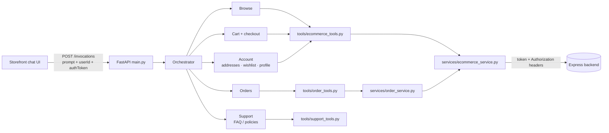

# 00 — Start here: architecture and design, explained

Read this first. It explains *how the bot thinks and where things live*, then
walks one real request end to end. The numbered docs after it are the reference
detail.

## 1. The one-paragraph version

`commerce-bot` is a chat brain for a shop. The shop's website/app sends it a
message plus the shopper's login token. A **manager agent** (the orchestrator)
reads the message, decides what the shopper wants, and hands it to one
**specialist agent** (browse, cart, orders, account, support). The specialist
talks to the shop's **existing backend over REST** using small **tools**, and
the manager relays the answer. The bot stores no shop data of its own.

## 2. Mental model: a shop with a front desk

| Real-life role | In the code |
|---|---|
| Front desk / receptionist | `OrchestratorAgent` (`agents/orchestrator_agent.py`) |
| The rule book the receptionist follows | `sops/chat/orchestrator.sop.md` |
| Department staff (cart, orders, account…) | specialist agents (`agents/*_agent.py`) |
| Each department's rule book | `sops/chat/<name>.sop.md` |
| Staff's phone/forms to talk to the warehouse | tools (`tools/*.py`, named `ecom_*`) |
| The warehouse | the Express backend (a separate project) |
| The shopper's ID badge | the JWT in `auth_state.token` |
| The notebook everyone shares during one visit | `agent.state["data"]` |

Two rules explain most design choices:

1. **The LLM decides, Python guards.** Routing and conversation are prompts
   (SOPs). Python does only what must never depend on a model's mood: attach the
   token, validate phone/pincode, refuse locked orders, block profile edits
   until the email is verified.
2. **Tools are thin, SOPs are the brain.** To change *what the bot says or asks*,
   edit an SOP. To change *what is allowed or sent to the backend*, edit a tool
   or service.

## 3. The big picture

Layers, top to bottom, each only talking to the one below:
**API → orchestrator → specialist → tools → services → backend.**

## 4. Follow one request: "cancel my order"

1. **UI → API.** The UI sends `POST /invocations` with
   `{"input": {"prompt": "cancel my order", "details": {"userId": "...", "authToken": "<jwt>"}}}`
   and the AgentCore session-id header.
2. **Session lookup (`main.py`).** One `OrchestratorAgent` is kept per session id,
   so the conversation continues across turns.
3. **Token adoption (`OrchestratorAgent.run`).** If `details.authToken` differs
   from the stored token it replaces it — so a refreshed JWT fixes an expired one
   mid-chat. The token is stored in `auth_state` with `verification_status: PASS`.
4. **Intent.** The orchestrator LLM (following its SOP) calls `IntentRouter` with
   `["ORDER_CANCEL"]`. That intent needs sign-in; `auth_status` is `PASS`.
5. **Hand-off.** It calls `ManageOrders`, which runs `OrderAgent` for one turn.
6. **Specialist conversation.** `OrderAgent` follows `order.sop.md`: list orders
   (`ecom_get_my_orders`), ask which one and why, **ask for confirmation**.
7. **Tool → service.** On "yes", `ecom_cancel_order_by_customer` calls
   `OrderService.cancel_order`, which first re-reads the order
   (`_ensure_changeable`) and refuses if it is already shipped/delivered, then
   `POST /orders/:id/cancel-by-customer`.
8. **Backend call.** `EcommerceService` sends the token as both
   `Authorization: Bearer <jwt>` and `token: <jwt>` (the web app's header).
9. **Finish.** The agent calls `commerce_complete_task`, which writes
   `status = COMPLETE` into the shared state. The orchestrator sees it and clears
   the per-flow keys (keeping the token and turn count).
10. **Response.** `{"output": {"message", "sessionData" (token redacted), ...}}`.

## 5. Authentication — there is no sign-in screen

The host app owns login. The bot only **borrows the shopper's JWT**.

- The UI must send `details.authToken` (and `details.userId`) on **every**
  request, not only the first. Use the web app's `getToken()` and check
  `isTokenExpired()` first.
- The token is attached to every backend call by the tools; the model never sees
  or types it.
- **Expired / invalid token** → backend answers 401 → `ResponseBuilder` turns it
  into `error: "token_expired"` → the SOPs tell the agent to ask the user for a
  fresh token (the UI should refresh and resend).
- **No token at all** → tools return `not_authenticated`; same message.
- `AuthAgent` (interactive email/password) still exists as a fallback but a
  token-only deployment never needs it.

## 6. The shared state ("the notebook")

Everything lives in one dict, `agent.state["data"]`, returned each turn:

| Key | Meaning |
|---|---|
| `sessionContext` | channel, role, userId (never the raw token) |
| `auth_state` | `token`, `user`, `verification_status`, `email_verified`, `email_attempts` |
| `intent`, `pending_intents`, `turn_count`, `active_agent` | routing bookkeeping |
| `*_state` | per-specialist `flow_started` flags |
| `status`, `task_summary`, `order_id` | set by `commerce_complete_task` / `commerce_fail_task`, consumed by the orchestrator |

Finished flows are wiped by `_reset_flow_state` so the next topic starts clean.
State is **in process memory per session id** — a restart loses it unless the UI
re-sends context (see risks in `06-hld.md`).

## 7. Guardrails that live in code, not prompts

| Rule | Where |
|---|---|
| Account-scoped intents need `auth_state.verification_status == PASS` | `_run_specialist` |
| 401 becomes `token_expired` | `utils/response.py` |
| Orders that are shipped/delivered/cancelled can't be cancelled or edited | `OrderService._ensure_changeable` |
| Customers may only edit delivery fields on an order | `CUSTOMER_EDITABLE_FIELDS` |
| Profile edit rejects email/password/role/etc. and needs the account email typed once | `UserAuthTools.update_my_profile`, `verify_account_email` |
| Address add/update validated: phone = 10-digit mobile, pincode = 6 digits, type = home/work; `userId` injected; `_id`/`userId` can't be changed | `AddressTools` (`_validate_address`) |
| Address edits/deletes/adds need **no** email check | by design |

## 8. Address flows (account agent)

- **Fields** (`IUserAddress`): `name`, `phone`, `pincode`, `addressLine1`, `city`
  required; `area`, `state`, `landMark`, `additionalInfo`, `alternatePhone`,
  `addressType` (`home`/`work`) optional.
- **Add:** the SOP makes the agent ask every field in small groups, show a
  summary, get a yes, then `ecom_add_address` (PUT `/user-address`). Never called
  with an empty body.
- **Update:** ask what to change → list addresses (`GET /user-address?userId=…`)
  → no addresses? offer to add one → pick one → confirm old vs new →
  `ecom_update_address`, which fetches the saved address and sends the *merged*
  full object on `PATCH /user-address/:id` (matching the web app).

## 9. Where do I change…?

| I want to… | Edit |
|---|---|
| change what the bot asks or says | `sops/chat/<agent>.sop.md` |
| change how requests are routed | `sops/chat/orchestrator.sop.md`, `INTENT_SPEC` |
| add/alter a backend call | `tools/ecommerce_tools.py` (+ add to the agent's `*_tools()` selector + SOP) |
| add business rules around orders | `services/order_service.py` |
| change auth headers | `services/ecommerce_service.py`, env `ECOMMERCE_AUTH_SCHEME`, `ECOMMERCE_TOKEN_HEADER` |
| add a new capability area | new specialist — see "Extension guide" in `07-lld.md` |

## 10. Debugging cheat-sheet

| Symptom | Likely cause | Check |
|---|---|---|
| "Please provide a fresh token" | no token in state, or backend 401 | log `Host token adopted/refreshed`; is `authToken` sent every request? first failing call's status |
| Every call 401 even with a fresh token | wrong header the backend reads | headers in debug log (`Authorization` and `token`); `ECOMMERCE_TOKEN_HEADER` |
| Address list empty | dummy/unknown `userId`, or wrong user | `GET /user-address params={'userId': …}` in log |
| `email_not_verified` | profile change before email check | expected; address changes don't need it |
| Bot stalls instead of asking questions | SOP gap | read the relevant SOP flow; test via `scripts/chat.py` |
| Slow replies | backend latency (the log prints `duration=` per call) | dev API cold starts; `ECOMMERCE_API_TIMEOUT` |
| State lost between turns | no session-id header, or process restarted | `main.py` `_get_orchestrator` |

## 11. Reading order

1. This file → 2. `01-overview.md` → 3. `06-hld.md` (design) → 4. `03-orchestrator-agent.md`
and `04-specialist-agents.md` → 5. `07-lld.md` (classes, algorithms) →
6. `05-services.md` and `09-ecommerce-tools.md` (reference).
