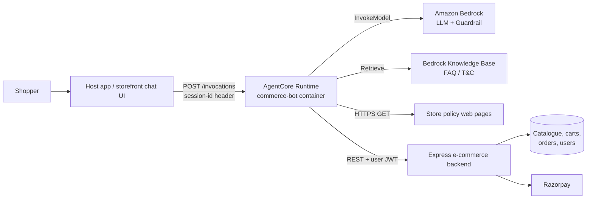
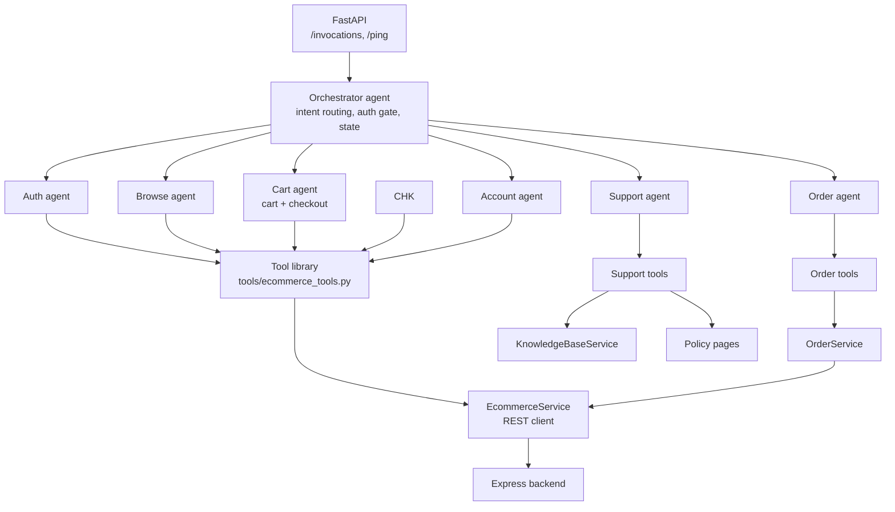
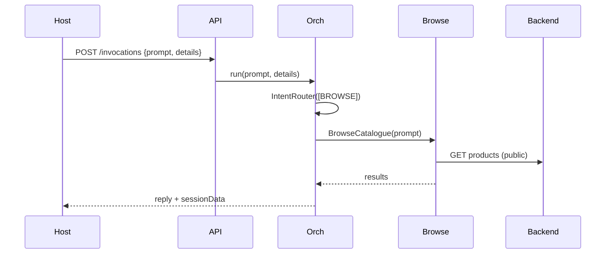
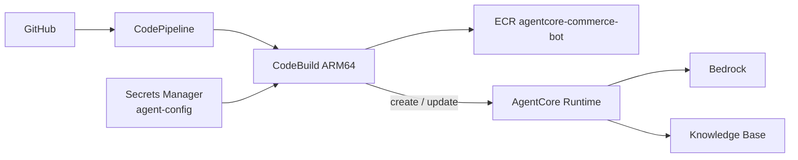

# 06 — High-level design (HLD)

## 1. Purpose and scope

`commerce-bot` is the conversational "agent brain" for an e-commerce
storefront. A shopper chats in natural language; the bot finds products,
manages the cart, runs checkout, tracks and cancels orders, maintains the
account (addresses, wishlist, profile) and answers store-policy questions.

**In scope:** intent routing, multi-turn flows, tool calls to the existing
backend, session state, deployment on Amazon Bedrock AgentCore.
**Out of scope:** the catalogue, cart, order, payment and user data stores.
They belong to the separate Express + TypeScript backend, which this service
only calls over REST.

## 2. Goals and constraints

| Goal | How it is met |
|---|---|
| Natural, multi-turn shopping | LLM-driven orchestration with isolated specialist agents |
| No invented data | Product, price, order and policy facts come only from tool output |
| Safe transactions | Sign-in gate in code; explicit user confirmation before place / cancel / modify |
| Low coupling to the backend | Thin REST client + services; one tool per endpoint |
| Cheap, fast turns | Prompt caching, per-specialist conversation summarising, small tool sets per agent |
| Stateless hosting | All session state lives in one dict that is returned to the caller |

Constraints: Python ≥ 3.13.7, AWS Strands Agents, Amazon Bedrock models,
ARM64 container, backend contract owned by another team.

## 3. System context

The host app owns the user's identity. It passes the already-issued backend JWT
in `input.details.authToken` on every request (the bot refreshes it each turn;
an expired token yields a "provide a fresh token" reply). Interactive sign-in by
the bot is a fallback only.

## 4. Logical architecture

| Layer | Responsibility | Where |
|---|---|---|
| API | HTTP contract, session-to-orchestrator mapping, state redaction | `main.py` |
| Orchestration | Classify intent, enforce sign-in, run one specialist per turn, reset flow state | `agents/orchestrator_agent.py`, `sops/chat/orchestrator.sop.md` |
| Specialists | One focused domain each, with its own prompt, history and tool set | `agents/*_agent.py`, `agents/base.py`, `sops/chat/*.sop.md` |
| Tools | Strands `@tool` functions the LLM can call; thin and deterministic | `tools/` |
| Services | REST client, normalised response envelope, domain rules | `services/`, `utils/response.py` |
| Models and config | Pydantic payload / state models, env-driven settings | `models/`, `configs/settings.py` |

## 5. Key design decisions

1. **The LLM routes; Python guards.** Routing lives in the orchestrator SOP.
   Python only runs a sub-agent, persists state and enforces auth.
2. **Specialists are isolated.** Separate `Agent`, history, summariser and SOP
   per domain, so a long checkout never pollutes browsing context.
3. **One state dict.** Everything is under `agent.state["data"]`; specialists
   read and mutate it through `ToolContext`. It is returned to the caller on
   every turn (token redacted).
4. **Terminal status via tools.** A transactional specialist ends a flow by
   calling `commerce_complete_task` or `commerce_fail_task`; the orchestrator
   then clears flow state.
5. **Least privilege per agent.** Each specialist gets a curated `ToolBundle`.
   Admin and staff endpoints exist as tools but are attached to no agent.
6. **Guarded writes.** Customer order edits and profile edits are restricted to
   allowed fields in code, not only in the prompt.
7. **Grounded support.** The support agent answers from the live policy pages,
   the knowledge base, then the bundled FAQ, never from model memory.

## 6. Main flows

**Anonymous browse**

**Authenticated action (cart, order, account, checkout)**: the orchestrator
checks `auth_state.verification_status`. If it is not `PASS` it calls the Auth
agent first; once signed in it runs the specialist. The user's JWT is attached
to every backend call by the tools.

**Checkout**: review cart, address, delivery charge, optional coupon, payment
method, explicit total confirmation, place order, then Razorpay
create / verify / capture for online payments. Ends with `COMPLETE` and an
order id.

## 7. Data and state

| Data | Owner | Notes |
|---|---|---|
| Products, carts, orders, users, payments | Express backend | Never stored in this service |
| Session state (`data`) | This service, per runtime session | In-process per `x-amzn-bedrock-agentcore-runtime-session-id`; returned to the caller each turn |
| Conversation history | Each agent's `messages` | Summarised when long; cleared on flow reset |
| FAQ / policy content | Knowledge base, website pages, `sops/faq.md` | Read-only; page text cached with a TTL |

## 8. Non-functional requirements

| Area | Approach |
|---|---|
| Security | JWT never echoed to the client or duplicated in `sessionContext`; masked in logs; Bedrock Guardrail on the orchestrator; field allow / deny lists on customer writes; policy fetches limited to configured URLs |
| Reliability | Tenacity retry (3 attempts, exponential backoff) on connection errors, timeouts and 5xx only; failures become structured error dicts for the LLM; specialist and orchestrator `run()` never raise to the caller |
| Performance | Anthropic prompt caching on system prompt and tools, summarising conversation managers, `temperature=0` for transactional agents, timing logs per REST call |
| Scalability | Horizontally scalable containers; state is per session |
| Observability | Structured `Logger` with seed id, `opentelemetry-instrument` wrapper at start-up |
| Configuration | Environment variables via `configs/settings.py`; only `REGION` and `ORCHESTRATOR_MODEL_ID` are mandatory |

## 9. Deployment view

- Image: ARM64, `uv` base image, `uvicorn main:app` on port 8080 under
  OpenTelemetry instrumentation.
- Infra as code: `infra/pipeline.yaml` (ECR, pipeline, roles, secret) and
  `infra/agentcore-role.yaml` (runtime execution role).
- Deploy scripts: `deploy_code.py`, `deploy_agent.py`, `deploy_aws.py`;
  `invoke_agent.py` and `scripts/chat.py` for remote and local testing.

## 10. Risks and open items

| Risk | Mitigation / next step |
|---|---|
| Session state is held in process memory | A restart or a different instance loses `data` unless the caller re-sends context. Use AgentCore Memory (`AGENTCORE_MEMORY_ID` is already a setting) or persist `sessionData` in the host |
| Backend response shapes are unspecified in this repo | Token and status extraction is best-effort; add contract tests when the OpenAPI spec is available |
| `role` allows `admin` and `delivery`, but no agent serves them | Add role-specific specialists and tool bundles, or restrict the role enum |
| Two tool result shapes (raw body vs `ApiResponse`) | Move older tool groups onto services returning `ApiResponse` |
| No `logout` or `reset_password` tool is attached to any agent | Add to the auth or account bundle if sign-out and reset are required |
