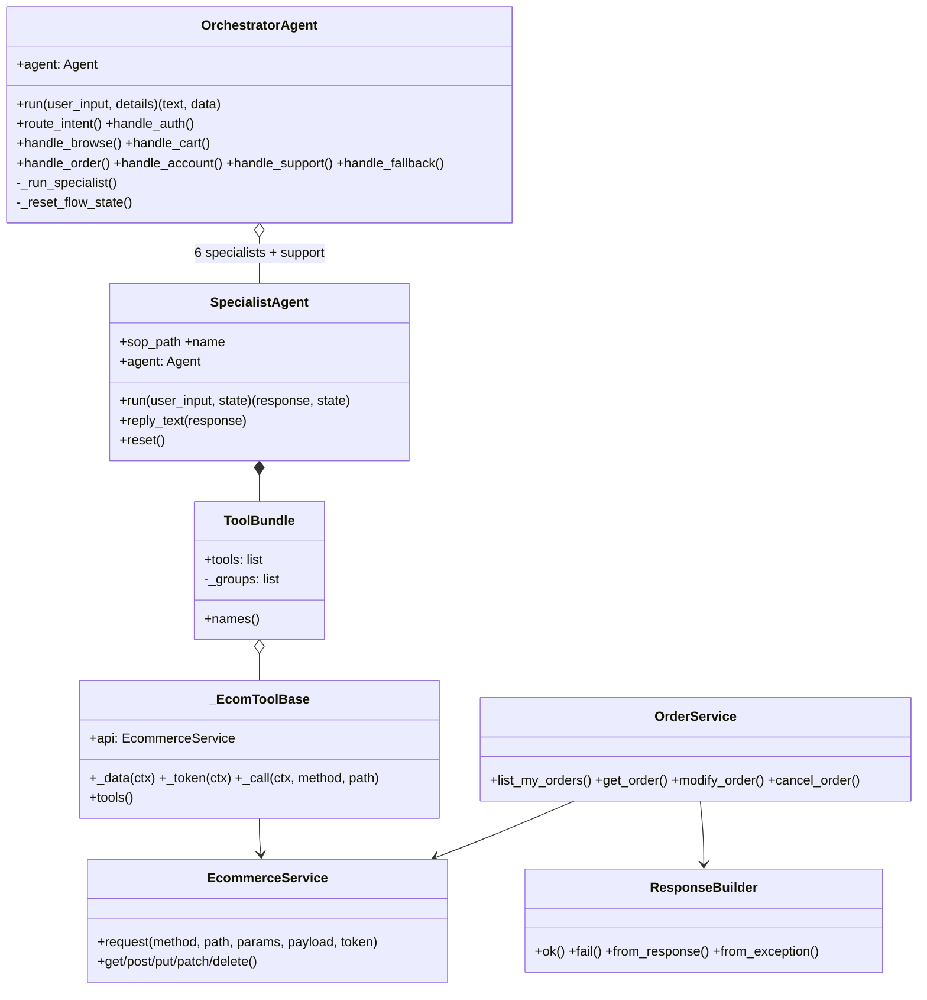

# 07 — Low-level design (LLD)

Companion to `06-hld.md`. Names below match the code.

## 1. Module layout

```
main.py                         FastAPI app: /invocations, /ping
agents/
  base.py                       SpecialistAgent (shared specialist base)
  orchestrator_agent.py         OrchestratorAgent + its @tool handlers
  auth_agent.py  browse_agent.py  cart_agent.py
  order_agent.py  account_agent.py  support_agent.py
tools/
  ecommerce_tools.py            _EcomToolBase, 16 tool groups, ToolBundle, per-agent selectors
  order_tools.py                OrderAgentTools + order_tools()
  support_tools.py              SupportTools + support_tools()
services/
  ecommerce_service.py          EcommerceService (generic REST client)
  order_service.py              OrderService (domain rules, ApiResponse)
  knowledge_base_service.py     KnowledgeBaseService (Bedrock retrieve)
models/
  agent_invocation_model.py     InvocationRequest / InvocationResponse
  invocation_payload.py         InvocationInput / InvocationOutput (typed)
  session_context.py            SessionContext
  session_state.py              AuthState, SessionData
utils/                          logger, wrapper decorators, retry, response, common, timer
configs/settings.py             Settings singleton
sops/chat/*.sop.md, sops/faq.md system prompts and store FAQ
```

## 2. Class model



Specialists: `AuthAgent`, `BrowseAgent`, `CartAgent` (cart + checkout),
`OrderAgent`, `AccountAgent`, `SupportAgent`. `AuthAgent`/`BrowseAgent` build on
`SpecialistAgent`; the others are standalone classes with the same `run` /
`reply_text` / `reset` interface.

## 3. API layer (`main.py`)

| Endpoint | Behaviour |
|---|---|
| `POST /invocations` | Body `{"input": {"prompt": str, "details": {...}}}`. 400 if `prompt` is empty. Looks up an `OrchestratorAgent` by header `x-amzn-bedrock-agentcore-runtime-session-id`; with no header, a fresh unstored orchestrator is used each turn. Returns `{"output": {message, timestamp, sessionId, sessionData, timeTaken}}` |
| `GET /ping` | Health check |

`sessionData` is a deep copy of `agent.state["data"]` with
`auth_state.token` truncated to 10 characters plus `…(redacted)`. Unhandled
exceptions return HTTP 500 with the error text.

Typed shapes live in `models/invocation_payload.py` (`InvocationInput`,
`InvocationOutput`); `InvocationRequest` and `InvocationResponse` still use
`Dict[str, Any]`.

## 4. Session state (`agent.state["data"]`)

Typed in `models/session_state.py` (`SessionData`, `AuthState`; extra keys
allowed).

| Key | Type | Set by |
|---|---|---|
| `sessionContext` | `{channel, role, locale, userId}` (no raw token) | orchestrator, first turn |
| `auth_state` | `{token, user, verification_status, source}` | orchestrator (host token, `source="host_app"`) or `ecom_login*` tools |
| `intent`, `pending_intents`, `turn_count` | list, list, int | `IntentRouter` |
| `active_agent` | `AUTH` / `BROWSE` / `CART` / `ORDER` / `ACCOUNT` / null | `_run_specialist`, `handle_auth` |
| `browse_state`, `cart_state`, `order_state`, `account_state` | `{flow_started, ...}` | `_run_specialist` |
| `status` | `COMPLETE` / `FAILED` (specialist error path sets `ERROR`) | `commerce_complete_task`, `commerce_fail_task`, `SpecialistAgent.run` |
| `task_summary`, `order_id` | str | flow-control tools |

`_FLOW_KEYS` (cleared by `_reset_flow_state`): `intent`, `pending_intents`,
`active_agent`, `status`, `task_summary`, `order_id` and the five `*_state`
keys. `sessionContext`, `auth_state` and `turn_count` are preserved.

## 5. Orchestrator

### 5.1 Construction

`BedrockModel(orchestrator_model_id, region, temperature=0, guardrail_id,
guardrail_version)`, with prompt-cache settings when the model id contains
`anthropic`. `SummarizingConversationManager(summary_ratio=0.8,
preserve_recent_messages=6)`. The system prompt is `chat/orchestrator.sop.md`
loaded through `CommonUtility.load_sop` (rendered with `{{BRAND_NAME}}` and a
cache point).

### 5.2 Tools

| Tool name | Method | Auth | Notes |
|---|---|---|---|
| `IntentRouter` | `route_intent` | n/a | Upper-cases and filters intents to `VALID_INTENTS`; empty becomes `UNKNOWN`; sets `intent`, `pending_intents`; increments `turn_count`; returns JSON with `auth_required` computed from `AUTH_INTENTS` |
| `Auth` | `handle_auth` | n/a | Returns `{"auth_status": "PASS"}` immediately if signed in; otherwise runs `AuthAgent` and returns `PASS` or `{"auth_status", "next_question"}` |
| `BrowseCatalogue` | `handle_browse` | no | |
| `ManageCart` | `handle_cart` | yes | |
| `ManageOrders` | `handle_order` | yes | |
| `ManageAccount` | `handle_account` | yes | |
| `Support` | `handle_support` | no | Runs `SupportAgent` once with empty state, then resets it |
| `Fallback` | `handle_fallback` | no | Static out-of-scope message |

### 5.3 `_run_specialist` algorithm

```
if needs_auth and auth_state.verification_status != "PASS":
    return {"status": "AUTH_REQUIRED", ...}
first_turn = not data[state_key].flow_started
if first_turn: mark flow_started; optionally prefix the input
response, updated = agent.run(input, {"data": data})
data = updated.data; data.active_agent = label; persist to orchestrator state
if data.status in (COMPLETE, FAILED):
    summary = data.task_summary or reply text
    _reset_flow_state(); return {status, message, order_id}
return {"status": "IN_PROGRESS", "response": reply text}
```

Because each specialist shares the same `data` dict, tools in the specialist
write terminal status directly into it.

### 5.4 Intent to handler map (`INTENT_SPEC`)

| Intent | Handler | Sign-in |
|---|---|---|
| BROWSE, PRODUCT_DETAIL | `handle_browse` | no |
| CART | `handle_cart` | yes |
| CHECKOUT | `handle_cart` | yes |
| ORDER_TRACK, ORDER_CANCEL | `handle_order` | yes |
| ACCOUNT | `handle_account` | yes |
| SUPPORT | `handle_support` | no |
| UNKNOWN | `handle_fallback` | no |

## 6. Specialist base (`agents/base.py`)

- Model: `BedrockModel(model_id or settings.specialist_model_id, temperature)`;
  Anthropic cache config only when the id contains `anthropic`.
- `SummarizingConversationManager(summary_ratio=0.3,
  preserve_recent_messages=10)` by default (cart/checkout uses 12).
- `run(user_input, state)`: set `agent.state["data"]`, call the agent, return
  `(response, {"data": ...})`. On any exception, set `status="ERROR"` and return
  "System error in <NAME>. Please try again."
- `reset()` clears `agent.messages` only; flow state is cleared by the orchestrator.

| Agent | SOP | Tool bundle | Temp | Model |
|---|---|---|---|---|
| Auth | `auth.sop.md` | `auth_tools` (6) | 0.1 | `auth_model_id` |
| Browse | `browse.sop.md` | `browse_tools` (13) | 0.2 | specialist |
| Cart | `cart.sop.md` | `cart_tools` (17, includes checkout + flow control) | 0.0 | specialist |
| Order | `order.sop.md` | `order_tools` (4 + flow control) | 0.0 | specialist |
| Account | `account.sop.md` | `account_tools` (12) | 0.0 | specialist |
| Support | `support.sop.md` | `support_tools` (4) | 0.0 | specialist |

## 7. Tool layer

### 7.1 Definition pattern

```python
class OrderAgentTools(_EcomToolBase):
    @tool(context=True, name="ecom_get_order_details")
    def get_order_details(self, order_id: str, tool_context: ToolContext) -> Any:
        """One-line purpose.\n\nArgs:\n    order_id: ..."""
```

- The docstring `Args:` block becomes the LLM-visible parameter schema.
- `context=True` gives access to `tool_context.agent.state` for the token and `data`.
- Names are prefixed: `ecom_*` (backend), `commerce_*` (flow control), `support_*`.

### 7.2 Attachment pattern

```
xxx_tools(logger_config) -> ToolBundle([group instances], _pick(group, "method", ...))
SpecialistAgent.__init__ -> Agent(tools=bundle.tools)
```

`_pick` raises `AttributeError` if a name is not a `@tool` method.
`ToolBundle` keeps group instances referenced so the bound methods stay valid.

### 7.3 `_EcomToolBase`

| Member | Behaviour |
|---|---|
| `_data(ctx)` | `ctx.agent.state.get("data") or {}` |
| `_token(ctx)` | `data["auth_state"]["token"]` |
| `_call(ctx, method, path, auth=True, params, payload)` | Reads the token (returns `not_authenticated` if missing), calls `EcommerceService.request`, converts exceptions to `{"error": "request_failed", ...}` |
| `tools()` | Collects every public method that has `tool_spec` |

### 7.4 Notable tools

| Tool | Detail |
|---|---|
| `ecom_login`, `ecom_login_social` | Extract the token from an unknown-shape body, then write `auth_state = {token, user, verification_status: "PASS"}` |
| `ecom_update_my_profile` | Resolves the user id from `auth_state.user`; rejects `email`, `password`, role, status, verification, token and id fields; `PATCH /users/:id` |
| `commerce_complete_task(summary, order_id="")` | Sets `status=COMPLETE`, `task_summary`, optional `order_id` |
| `commerce_fail_task(reason)` | Sets `status=FAILED`, `task_summary` |
| Order tools | Use `OrderService`; return `ApiResponse.to_dict()` |
| `support_read_website_page` | Only labelled URLs from `SUPPORT_PAGE_URLS`; HTML to text; trimmed to relevant paragraphs; cached with a TTL |
| `support_search_knowledge_base` | `KnowledgeBaseService.retrieve`; returns `DISABLED`, `NO_MATCH`, `ERROR` or `OK` with passages |

Tools not attached to any agent (admin and staff) are listed in the code
review notes; attach them only with a role-aware design.

## 8. Service layer

### 8.1 `EcommerceService.request`

```
url      = urljoin(base_url + "/", path.lstrip("/"))
headers  = {"Content-Type": "application/json", "Authorization": "<scheme> <token>"?}
response = _send(...)           # @retry_api_call, raise_for_status()
return   = response.json()  |  {"statusCode": n}  |  {"statusCode": n, "raw": text}
```

- Retry: `tenacity`, 3 attempts, exponential wait 1 to 10 s, only for
  `ConnectionError`, `Timeout` and HTTP 5xx.
- Timeout: `ecommerce_api_timeout` (default 30 s). Authorization is masked in logs.

### 8.2 `OrderService`

| Method | Backend call | Rules |
|---|---|---|
| `list_my_orders(token, filters)` | `GET /my-orders` | |
| `get_order(token, id)` | `GET /order-details/:id` | |
| `modify_order(token, id, updates)` | `PATCH /orders/:id` | Only `CUSTOMER_EDITABLE_FIELDS`; empty or disallowed updates fail; blocked when status is in `LOCKED_STATUSES` |
| `cancel_order(token, id, reason)` | `POST /orders/:id/cancel-by-customer` | Blocked when status is in `LOCKED_STATUSES` |

Status is found by `find_status`, which searches `status` / `orderStatus` through
`data`, `order` and `result`. The backend remains the final authority.

### 8.3 `ApiResponse` envelope (`utils/response.py`)

```
{ success: bool, status_code: int|None, data: Any, message: str|None, error: str|None }
```

| Source | `error` |
|---|---|
| HTTP 4xx / 5xx | `http_<code>`, message from body `message` or `error` |
| Timeout | `timeout` |
| Connection failure | `connection_error` |
| Other exception | `request_failed` |
| Builder failure | `response_build_failed` |

Success is reported with status 200 regardless of the real 2xx code.

### 8.4 `KnowledgeBaseService`

`boto3` `bedrock-agent-runtime` client created only when `KNOWLEDGE_BASE_ID` is
set; `retrieve(query)` returns `[{text, source, score}]` (top `KNOWLEDGE_BASE_TOP_K`).

## 9. Prompts (SOPs)

`CommonUtility.load_sop` reads `sops/<path>`, substitutes `{{BRAND_NAME}}`, and
appends a cache point. Each SOP lists the tools its agent owns and the
confirm-before-write rules. The orchestrator SOP contains the intent table,
turn flow, routing table and response rules; `faq.md` is read as plain text by
`support_get_faq`.

## 10. Configuration

| Variable | Default | Use |
|---|---|---|
| `REGION` (required) | none | Bedrock and Knowledge Base region |
| `ORCHESTRATOR_MODEL_ID` (required) | none | Orchestrator model; default for all agents |
| `SPECIALIST_MODEL_ID`, `AUTH_MODEL_ID` | orchestrator / specialist | Per-agent model overrides |
| `GUARDRAIL_ID`, `GUARDRAIL_VERSION` | none | Orchestrator guardrail |
| `ECOMMERCE_API_BASE_URL` | none | Backend base URL |
| `ECOMMERCE_AUTH_SCHEME` | `Bearer` | Authorization scheme |
| `ECOMMERCE_API_TIMEOUT` | 30 | Seconds |
| `KNOWLEDGE_BASE_ID`, `KNOWLEDGE_BASE_TOP_K` | set / 5 | Support retrieval |
| `SUPPORT_PAGE_URLS` | empty | `label=url,label=url` allow-list |
| `SUPPORT_PAGE_CACHE_TTL`, `_TIMEOUT`, `_MAX_CHARS` | 3600 / 10 / 12000 | Page fetch tuning |
| `BRAND_NAME` | `the store` | Prompt branding |
| `AGENTCORE_MEMORY_ID` | none | Reserved for AgentCore Memory |
| `APP_ENV`, `LOG_LEVEL`, `LOG_FORMAT`, `ENABLE_STRANDS_LOG` | dev / DEBUG / ... | Logging |

## 11. Error handling matrix

| Failure | Handling | User-visible result |
|---|---|---|
| Missing prompt | HTTP 400 | Error response |
| Backend 4xx | `ApiResponse` or `{"error": ...}` returned to the LLM | The agent explains and offers next steps |
| Backend 5xx / network | 3 retries, then error dict | Agent apologises, may call `commerce_fail_task` |
| Not signed in | `not_authenticated` from the tool, `AUTH_REQUIRED` from the orchestrator | Prompt to sign in |
| Specialist exception | `SpecialistAgent.run` returns a system-error string, `status="ERROR"` | Generic retry message |
| Orchestrator exception | Returns "Sorry, something went wrong." and empty state | Generic retry message |
| Unknown / out-of-scope intent | `Fallback` tool | Capability summary |

## 12. Test strategy

Existing tests: `tests/test_order_service.py`, `test_response.py`,
`test_support_tools.py`. Suggested additions:

| Test | Purpose |
|---|---|
| Bundle wiring | Every `xxx_tools()` builds; names match the SOP tool list; no duplicates within a bundle |
| `ecom_update_my_profile` | Protected fields rejected; user id taken from `auth_state` |
| `_run_specialist` | `AUTH_REQUIRED` gate; `COMPLETE` resets flow state; `IN_PROGRESS` keeps it |
| `EcommerceService` | Retry only on 5xx / connection errors; header and URL construction (mock `requests`) |
| API | 400 on empty prompt; token redaction in `sessionData` |

## 13. Extension guide

**Add a tool:** write a `@tool` method on a group, add its name to the right
`xxx_tools()` selector, mention it in that agent's SOP.

**Add a specialist:** create `agents/<name>_agent.py` extending
`SpecialistAgent`, a tool factory, and an SOP; register it in the orchestrator
(`__init__`, an `INTENT_SPEC` entry, a `handle_*` tool, `_FLOW_KEYS` and the
reset list) and describe the intent in `orchestrator.sop.md`.

**Add a backend domain service:** wrap `EcommerceService`, return `ApiResponse`,
keep business rules (field allow-lists, status locks) in the service, and keep
the tool a thin wrapper.
